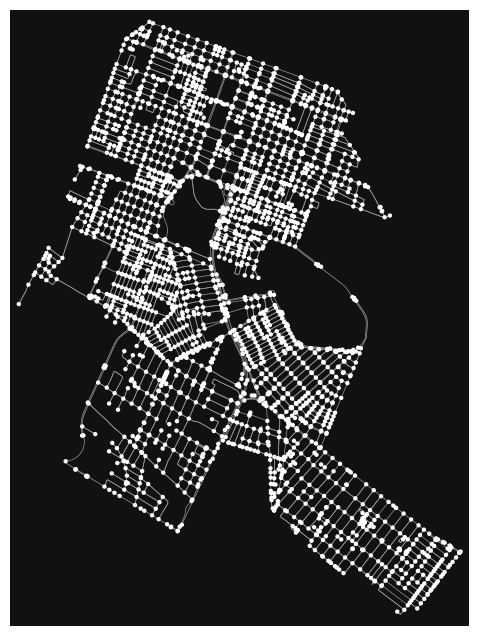
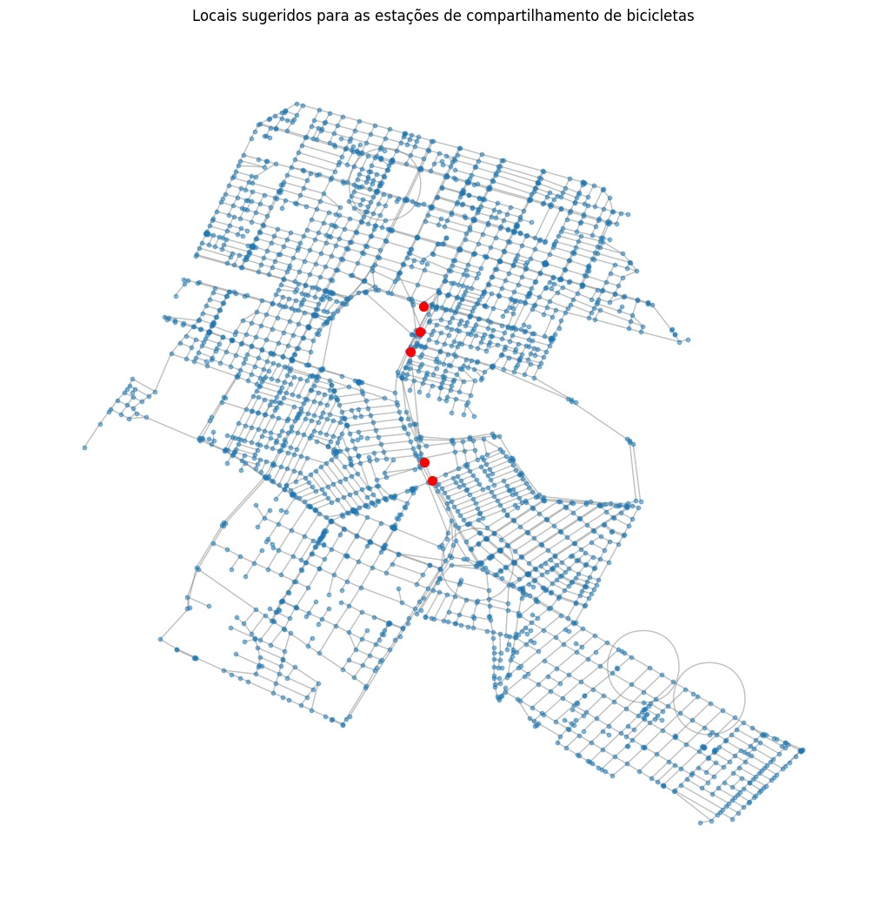

## Unidade 1 - Trabalho 5 (final)

#Resumo

Neste notebook, realizaremos uma análise de pontos de compartilhamento de bicicletas nas proximidades da Universidade Federal do Rio Grande do Norte (UFRN), focalizando os bairros de Lagoa Nova, Capim Macio, Nova Descoberta e Candelária. O objetivo principal é avaliar a conectividade e a acessibilidade dessas áreas em relação à UFRN, identificando as principais vias de acesso, as rotas mais curtas entre os bairros, e a influência de potenciais alterações na infraestrutura.

- Avaliação da mobilidade no entorno da UFRN, em Natal-RN.
- Bairros analisados: Lagoa Nova, Capim Macio, Nova Descoberta e Candelária.
- Ideia central: Colocar dock-station(S) de
compartilhamento de bicicletas com base nos pontos mais estratégicos.

#Vídeo explicativo (10min)

#Explicação detalhada dos resultados (README.md)